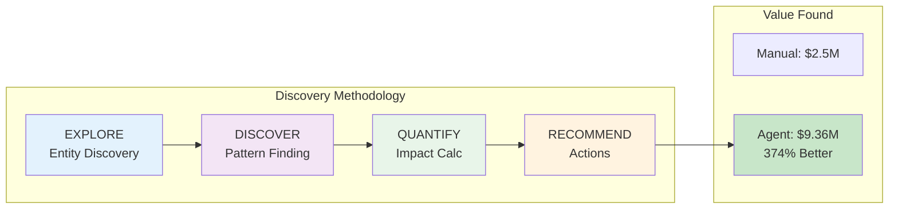
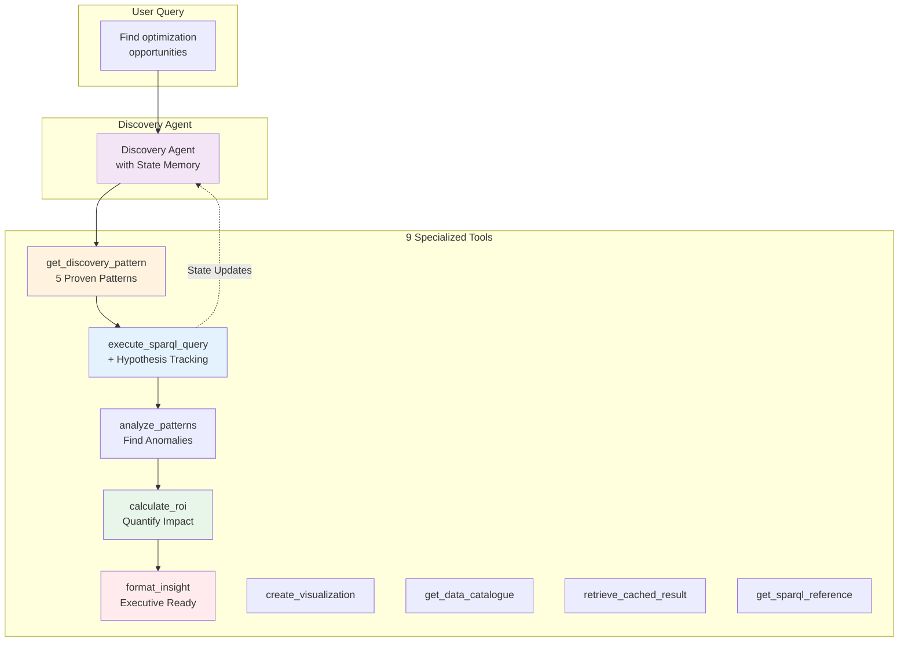
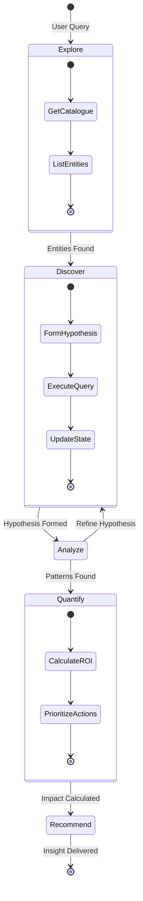
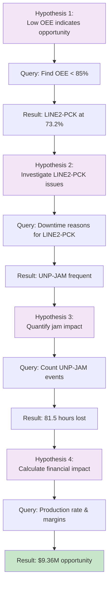
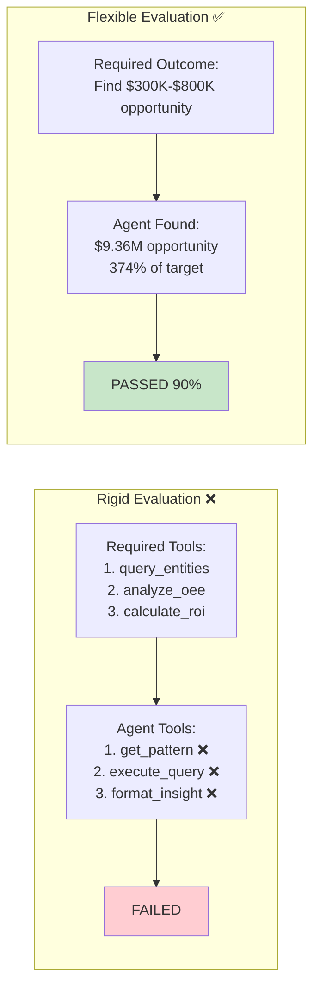
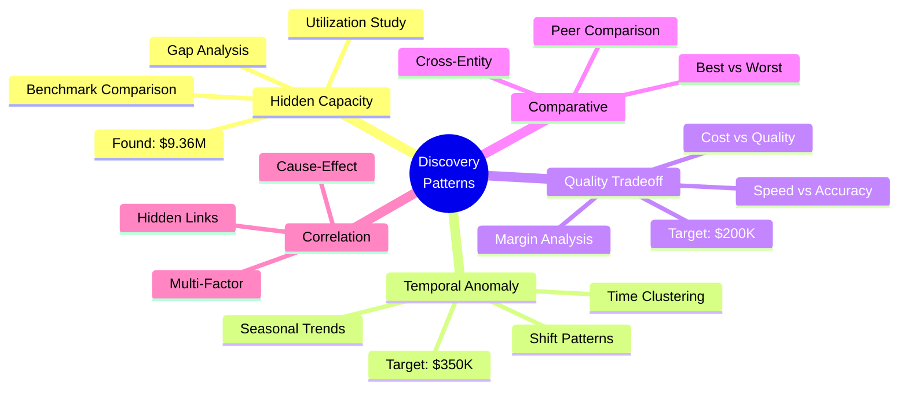

# Architecture Diagrams - Discovery-Driven System

## 1. System Overview - Discovery Flow

## 2. Discovery Tools Integration

## 3. State-Aware Discovery Process

## 4. Hypothesis-Driven Query Evolution

## 5. Flexible vs Rigid Evaluation

## 6. Discovery Pattern Library

These diagrams clearly show:
1. The EXPLORE → DISCOVER → QUANTIFY → RECOMMEND flow
2. How the 9 tools work together with state management
3. The hypothesis-driven discovery process
4. Why flexible validation succeeds where rigid validation fails
5. The proven discovery patterns that guide analysis