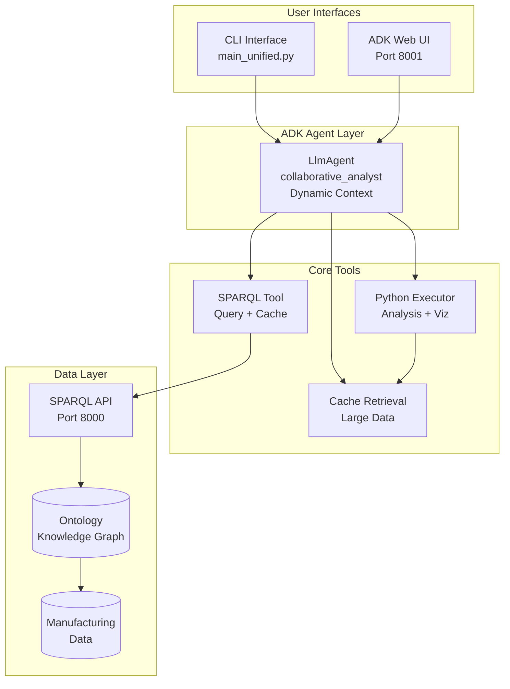

# Ontology-Augmented Manufacturing Analytics System

> Transform raw manufacturing data into actionable business insights through semantic ontologies and conversational AI

This project represents a complete end-to-end pipeline that transforms raw manufacturing data into actionable business insights through the power of semantic ontologies and conversational AI. At its core, it demonstrates how traditional operational data can be elevated beyond simple reporting into a discovery engine that uncovers hidden optimization opportunities worth millions in potential savings.

## 📋 Table of Contents

- [Overview](#overview)
- [Architecture](#architecture)
- [Quick Start](#quick-start)
- [Installation](#installation)
- [Core Components](#core-components)
- [Usage Guide](#usage-guide)
- [Example Analysis](#example-analysis)
- [Configuration](#configuration)
- [Performance Optimization](#performance-optimization)
- [Development Guide](#development-guide)
- [Troubleshooting](#troubleshooting)
- [Contributing](#contributing)

## Overview

### The Data Foundation

The journey begins with realistic manufacturing data generation that simulates a multi-line production facility. The data generator creates 30 days of 5-minute interval production logs, including:
- OEE (Overall Equipment Effectiveness) metrics
- Downtime events with root causes
- Quality measurements and scrap rates
- Production volumes by product

What makes this data special is that it's designed with hidden patterns and opportunities - like equipment that consistently underperforms due to specific jam events, or quality variations that correlate with shift changes. This synthetic data mirrors real-world manufacturing complexity while ensuring reproducible scenarios for testing and demonstration.

### The Semantic Layer

The raw data flows into an OWL ontology that acts as a semantic bridge between operational data and natural language queries. This isn't just a schema - it's a knowledge representation that captures the relationships between:
- Equipment hierarchy (Lines → Equipment → Process flow)
- Production orders and products
- Events and their impacts
- Temporal patterns and causality

The ontology population process transforms flat data into a rich graph of interconnected entities. For example, a simple production record becomes an entity that "belongsToLine", "executesOrder", "producesProduct", and "logsEvent" - creating a web of meaning that enables sophisticated reasoning.

### The Query Interface

A SPARQL API built on Owlready2 provides the query interface to this semantic layer. While SPARQL might seem like a technical barrier, it becomes invisible to end users through the conversational agent. The API handles:
- Complex semantic queries with relationships
- Query caching and optimization
- Result summarization for large datasets
- Intelligent error handling with helpful guidance

### The Conversational Intelligence

The Google ADK-based agent is where the magic happens. Built with a collaborative philosophy, it doesn't just execute queries - it guides users through a discovery process. The agent:
- Understands manufacturing domain concepts
- Converts business questions into SPARQL queries
- Handles large result sets through intelligent caching
- Performs advanced Python-based analysis when SPARQL reaches its limits
- Employs progressive context loading that reduces token usage by 50-70%

### The Discovery Methodology

What sets this system apart is its discovery-driven methodology. Rather than requiring users to know what questions to ask, the agent helps explore what's possible:

1. **Entity Discovery** - "What equipment exists?"
2. **Validation** - Verify findings match reality
3. **Targeted Analysis** - Build specific queries based on discoveries
4. **Financial Impact** - Always tie discoveries to P&L impact
5. **Actionable Insights** - Suggest specific actions with confidence levels

### The Unified Experience

From a user's perspective, all this complexity disappears. They simply have a conversation:
- *"What equipment has the most improvement potential?"*
- *"Why do small problems cascade into big ones?"*
- *"Where's the sweet spot between quality and cost?"*

The system handles the rest - discovering entities, building queries, managing tokens, caching results, performing analysis, and delivering insights.

## Architecture

The system implements a streamlined architecture leveraging Google ADK's native capabilities:



### Key Architectural Principles

1. **Minimal Tool Surface** - Just 3 tools enable unlimited analysis
2. **Progressive Context Loading** - Reduces tokens by 50-70% for simple queries
3. **Natural Discovery** - Patterns emerge through exploration
4. **Token Safety First** - Intelligent handling of large datasets
5. **Native ADK Integration** - Full utilization of framework capabilities

## Quick Start

Get the system running in under 5 minutes:

```bash
# 1. Clone the repository
git clone https://github.com/yourusername/ontology-project.git
cd ontology-project

# 2. Install dependencies
pip install -r requirements.txt

# 3. Set up environment variables
cp .env.example .env
# Edit .env and add your GOOGLE_API_KEY

# 4. Generate or refresh all data (recommended)
python orchestrate_data_pipeline.py

# 5. Start the services
./start_services.sh

# 6. Open the Web UI
# Navigate to http://localhost:8001/dev-ui/
```

That's it! Start asking questions like:
- "What equipment exists in the system?"
- "Show me the worst performing equipment"
- "Find opportunities to improve OEE"

## Installation

### Prerequisites

- Python 3.9 or higher
- Google Cloud API key with Gemini access
- Unix-like environment (macOS, Linux, WSL)

### Detailed Setup

1. **Clone and Navigate**
   ```bash
   git clone https://github.com/yourusername/ontology-project.git
   cd ontology-project
   ```

2. **Create Virtual Environment (Recommended)**
   ```bash
   python -m venv venv
   source venv/bin/activate  # On Windows: venv\Scripts\activate
   ```

3. **Install Dependencies**
   ```bash
   pip install -r requirements.txt
   ```

4. **Configure Environment**
   ```bash
   # Create .env file
   cat > .env << EOF
   GOOGLE_API_KEY=your-google-api-key
   DEFAULT_MODEL=gemini-2.0-flash
   SPARQL_ENDPOINT=http://localhost:8000/sparql/query
   EOF
   ```

5. **Generate or Refresh All Data**
   ```bash
   # Orchestrate the complete data pipeline
   python orchestrate_data_pipeline.py
   
   # This single command will:
   # - Validate configuration
   # - Generate manufacturing data
   # - Populate the ontology
   # - Extract ontology mindmap
   # - Generate data catalogue
   # - Validate all outputs
   
   # Optional flags:
   python orchestrate_data_pipeline.py --dry-run    # Preview without executing
   python orchestrate_data_pipeline.py --force      # Overwrite existing files
   python orchestrate_data_pipeline.py --skip-backup # Skip backup step
   ```
   
   For manual control over individual steps:
   ```bash
   # Generate only manufacturing data
   python Data_Generation/mes_data_generation.py
   
   # Populate only the ontology
   python Ontology_Generation/mes_ontology_population.py
   ```

## Core Components

### 1. Data Generation (`Data_Generation/`)

The data generator creates realistic manufacturing scenarios:

```python
# Configuration in mes_data_config.json defines:
- 3 production lines with 3 equipment each
- 5 different products with varying margins
- Planned/unplanned downtime patterns
- Hidden optimization opportunities
```

Key features:
- Configurable anomaly injection
- Realistic shift patterns
- Product-specific performance variations
- Time-based event clustering

### 2. Ontology Management (`Ontology_Generation/`)

The semantic layer that gives meaning to data:

```
Equipment --belongsToLine--> ProductionLine
ProductionLine --executesOrder--> ProductionOrder
ProductionOrder --producesProduct--> Product
Equipment --logsEvent--> DowntimeEvent
```

Key files:
- `mes_ontology_populated.owl` - The populated knowledge graph
- `mes_ontology_population.py` - Population logic
- `Tbox_Rbox.md` - Ontology schema documentation

### 3. SPARQL API (`API/`)

FastAPI-based SPARQL endpoint:

```python
# Example endpoint
POST /sparql/query
{
    "query": "SELECT ?equipment WHERE { ?equipment a mes:Equipment }",
    "max_results": 1000
}
```

Features:
- Query validation and sanitization
- Timeout handling (30s default)
- Result caching
- Helpful error messages

### 4. ADK Agent System (`adk_agents/`)

The conversational AI brain:

**Unified Agent** (`manufacturing_agent/agent.py`)
- Single agent serves both CLI and Web interfaces
- Dynamic context loading based on analysis phase
- Tool context state management

**Progressive Context Loading** (`context/context_loader.py`)
- Initial: System prompt + data catalog + ontology
- SPARQL phase: Adds query syntax and patterns
- Python phase: Adds analysis capabilities

**Core Tools** (`tools/`)
- `sparql_tool.py` - SPARQL execution with caching
- `python_executor.py` - DataFrame analysis and visualization
- `cache_manager.py` - Pattern learning and optimization

### 5. Data Pipeline Orchestration

**Orchestration Script** (`orchestrate_data_pipeline.py`)
- Automates the complete data generation workflow
- Validates configuration before execution
- Provides dry-run mode for testing
- Supports parallel execution of independent steps
- Creates backups of existing data
- Comprehensive error handling and logging

Key features:
- Configuration validation with business rule checks
- Progress tracking with detailed status updates
- Output validation to ensure data consistency
- Selective step execution for development

### 6. Service Management Scripts

- `start_services.sh` - Launches SPARQL API and ADK Web UI
- `stop_services.sh` - Gracefully stops all services
- `check_services.sh` - Monitors service health

## Usage Guide

### Web Interface (Recommended)

1. Start the services:
   ```bash
   ./start_services.sh
   ```

2. Open your browser:
   ```
   http://localhost:8001/dev-ui/
   ```

3. Start exploring:
   - Ask natural language questions
   - View generated SPARQL queries
   - See Python analysis code
   - Export results and visualizations

### CLI Interface

1. Start the SPARQL API:
   ```bash
   python -m uvicorn API.main:app --port 8000
   ```

2. Run the CLI:
   ```bash
   python -m adk_agents.main_unified
   ```

3. Interactive commands:
   - Type questions naturally
   - `help` - Show available commands
   - `reset` - Start fresh conversation
   - `exit` - Quit the CLI

### Direct Script Usage

```bash
cd adk_agents
./run_cli.sh
```

## Example Analysis

### Discovery Example

**User**: "What equipment has the most downtime?"

**Agent Process**:
1. Discovers all equipment in the system
2. Queries downtime events per equipment
3. Calculates total downtime hours
4. Identifies top offenders
5. Calculates financial impact

**Result**: "LINE2-PCK has 81.5 hours of downtime, causing $9.36M in lost production annually"

### Pattern Recognition Example

**User**: "Are there patterns in when equipment fails?"

**Agent Process**:
1. Queries temporal event data
2. Uses Python to analyze clustering
3. Identifies shift-based variations
4. Discovers micro-stop cascades
5. Suggests predictive maintenance schedule

### Financial Optimization Example

**User**: "Where should we invest to maximize ROI?"

**Agent Process**:
1. Analyzes quality vs cost trade-offs
2. Calculates improvement scenarios
3. Models investment payback periods
4. Prioritizes by financial impact
5. Provides confidence levels

## Configuration

### Environment Variables

```bash
# LLM Configuration
GOOGLE_API_KEY=your-api-key          # Required
DEFAULT_MODEL=gemini-2.0-flash       # Model to use
MODEL_TEMPERATURE=0.1                # Lower = more deterministic

# SPARQL Configuration  
SPARQL_ENDPOINT=http://localhost:8000/sparql/query
SPARQL_TIMEOUT=30                    # Query timeout in seconds
SPARQL_MAX_RESULTS=10000            # Max results per query

# Cache Configuration
CACHE_ENABLED=true                   # Enable result caching
CACHE_TTL=3600                      # Cache time-to-live
CACHE_DIR=./adk_agents/cache        # Cache directory

# Analysis Configuration
ONTOLOGY_NAMESPACE=mes_ontology_populated
```

### Performance Tuning

```python
# In config/settings.py
SETTINGS = {
    "max_context_tokens": 32000,     # Reduce for faster responses
    "result_summary_threshold": 10000, # When to summarize results
    "cache_cleanup_days": 7,          # Auto-cleanup old cache
    "session_timeout_hours": 24       # When to suggest new session
}
```

## Performance Optimization

### Token Usage Optimization

1. **Progressive Context Loading**
   - Simple queries use minimal context
   - Complex queries load additional guides
   - Reduces tokens by 50-70%

2. **Smart Result Caching**
   - All queries cached by SHA256 hash
   - Large results summarized automatically
   - Full data available via cache ID

3. **Session Management**
   - Monitor session age and size
   - Suggest fresh sessions proactively
   - Preserve key findings across sessions

### Query Performance

1. **SPARQL Optimization**
   - Use LIMIT for exploration
   - Filter early in query
   - Leverage ontology relationships

2. **Caching Strategy**
   - Query results cached indefinitely
   - Pattern learning improves over time
   - Successful patterns reused

### Best Practices

1. Start with discovery queries
2. Use specific entity names when known
3. Let the agent guide the exploration
4. Trust the financial calculations
5. Ask for visualizations when needed

## Development Guide

### Extending the System

#### Adding New Data Sources

1. Update `mes_data_config.json` with new entities
2. Modify `mes_data_generation.py` to generate data
3. Update ontology schema in `Tbox_Rbox.md`
4. Repopulate ontology

#### Adding New Analysis Patterns

1. Update `python_analysis_guide.md` with examples
2. Add successful patterns to `query_patterns.json`
3. Test with the agent

#### Customizing the Agent

1. Modify `system_prompt.md` for behavior
2. Adjust context loading in `context_loader.py`
3. Add new tools in `tools/` directory

### Domain Adaptation

The system is designed for any domain with:
- Structured operational data
- Measurable performance metrics
- Financial impact potential
- Temporal patterns

Adaptation checklist:
- [ ] Map domain entities to ontology
- [ ] Define key performance metrics
- [ ] Identify financial drivers
- [ ] Create domain-specific prompts
- [ ] Generate sample data
- [ ] Test discovery patterns

## Troubleshooting

### Common Issues

#### Services won't start
```bash
# Check if ports are in use
lsof -i :8000
lsof -i :8001

# Force stop existing services
./stop_services.sh

# Try again
./start_services.sh
```

#### SPARQL queries failing
- Check the SPARQL API is running: `curl http://localhost:8000/health`
- Verify ontology file exists: `ls Ontology/mes_ontology_populated.owl`
- Check API logs: `tail -f sparql_api.log`

#### Agent not responding
- Verify Google API key is set correctly
- Check model availability in your region
- Monitor token usage in responses
- Try resetting the conversation

#### Large result sets causing issues
- The system automatically handles results >10k tokens
- Use cache IDs to retrieve full data
- Consider adding LIMIT to queries

### Debug Mode

Enable detailed logging:
```python
# In your .env file
LOG_LEVEL=DEBUG
ADK_DEBUG=true
```

### Getting Help

1. Check the logs:
   - `sparql_api.log` - SPARQL API issues
   - `adk_web.log` - ADK Web UI issues

2. Common fixes:
   - Restart services: `./stop_services.sh && ./start_services.sh`
   - Clear cache: `rm -rf adk_agents/cache/results/*`
   - Reset conversation in UI or CLI


## Acknowledgments

- Built with [Google Agent Development Kit (ADK)](https://github.com/google/genai-agent-dev-kit)
- Ontology management via [Owlready2](https://owlready2.readthedocs.io/)
- API framework: [FastAPI](https://fastapi.tiangolo.com/)
- LLM: [Gemini 2.0 Flash](https://deepmind.google/technologies/gemini/)

---

*This architecture demonstrates that the future of business intelligence isn't about better dashboards or more complex queries - it's about systems that think alongside users, discovering opportunities that would otherwise remain hidden in the vast sea of operational data.*