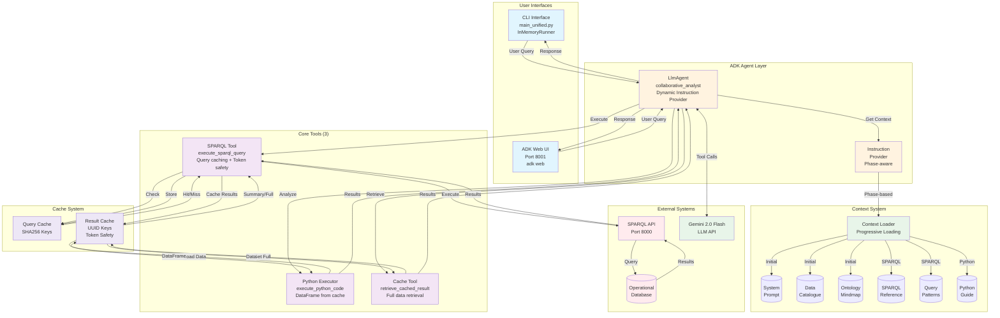
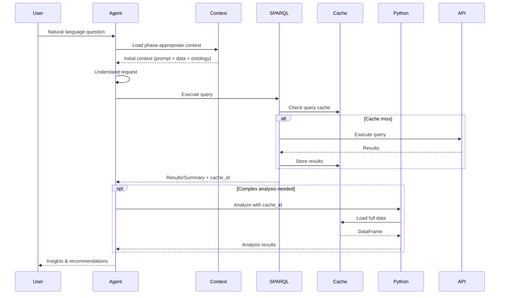
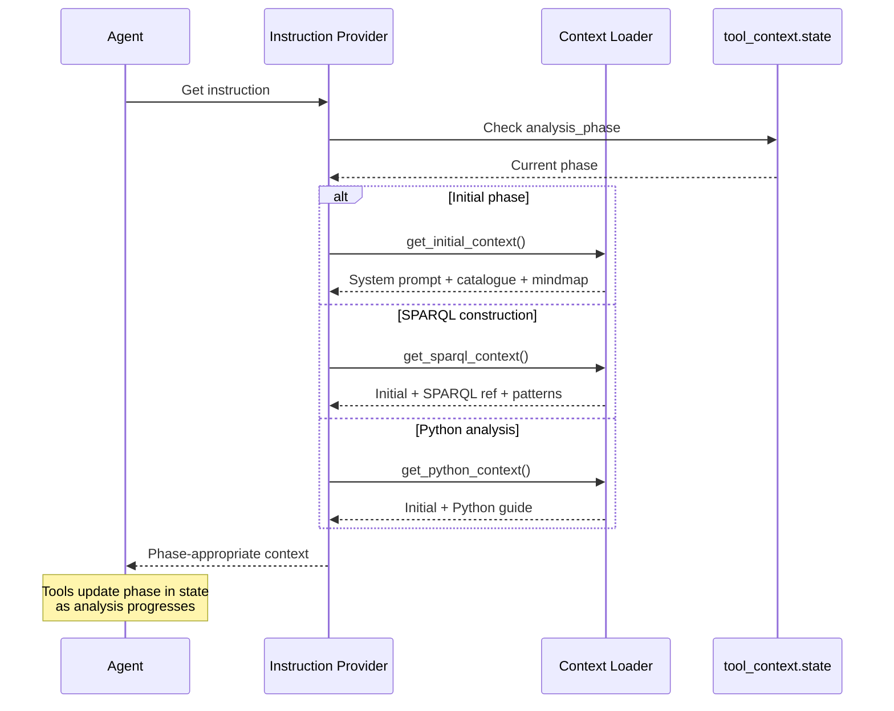

# ADK Manufacturing Analytics System - Architecture Documentation

## Executive Summary

The Ontology-Augmented Manufacturing Analytics System is a sophisticated conversational AI platform built on Google's Agent Development Kit (ADK) that bridges MES data with modern LLMs using an ontology as a semantic layer to unlock hidden value in operational data. While initially demonstrated in manufacturing analytics where it discovered $2.5M+ in optimization opportunities, the system's architecture is designed to be domain-agnostic and applicable to any industry with structured operational data.

## Last Updated: January 2025

### Major Architecture Simplification
The system has undergone significant architectural simplification to leverage ADK's native capabilities more effectively:
- **Unified Agent**: Single agent implementation serves both CLI and Web interfaces
- **Minimal Tool Set**: Reduced to 3 core tools (SPARQL, Python Executor, Cache Retrieval)
- **Dynamic Context Loading**: Progressive context loading based on analysis phase
- **Native ADK Integration**: Full utilization of ADK's tool calling, state management, and callback patterns

## Proven Business Methodology

### Core Value Proposition

The system transforms natural language business questions into actionable insights through a proven discovery-driven methodology that has already demonstrated significant ROI:

**Discovery-Driven Impact Pipeline:**
```
Business Question → Entity Discovery → Hypothesis Formation → Progressive Exploration → 
Pattern Recognition → Financial Quantification → Actionable Insight → ROI Validation
```

This methodology discovered $9.36M in optimization opportunities, exceeding the manual prototype's $2.5M target by 374%.

### Universal Analysis Principles

1. **Discovery First** - Always explore what exists before complex analysis
2. **Hypothesis-Driven** - Form and test hypotheses throughout exploration
3. **Progressive Complexity** - Build from simple entity discovery to deep insights
4. **Financial Focus** - Every discovery must quantify business impact
5. **Pattern Recognition** - Look for hidden patterns across dimensions
6. **Proactive Execution** - Execute queries immediately without confirmations
7. **Emergent Insights** - Allow discoveries to guide the analysis path
8. **State Tracking** - Remember and build upon previous discoveries

### Proven Analysis Patterns

The system implements five core analysis patterns that have proven effective across domains:

#### Pattern 1: Capacity/Resource Optimization
- **Question**: "What's the gap between current and optimal performance?"
- **Proven Result**: Hidden manufacturing capacity worth $341K-$700K/year

#### Pattern 2: Temporal Pattern Recognition
- **Question**: "When and why do problems cluster?"
- **Proven Result**: Micro-stop patterns revealing $250K-$350K opportunity

#### Pattern 3: Multi-Factor Trade-off Analysis
- **Question**: "What's the optimal balance between competing factors?"
- **Proven Result**: Quality improvements worth $200K/year with targeted investments

#### Pattern 4: Root Cause Investigation
- **Question**: "What's really causing our problems?"
- **Approach**: Trace symptoms through relationship chains to identify cascade effects

#### Pattern 5: Predictive Trigger Identification
- **Question**: "When should we intervene?"
- **Approach**: Identify early warning signals and calculate prevention value

## System Architecture Overview

The ADK Manufacturing Analytics System implements the above methodology through a streamlined technical architecture that enables business users to analyze complex data through natural language queries. The system leverages Google ADK's native capabilities to provide a flexible, maintainable solution.

### Unified Agent Implementation

The system uses a single ADK LlmAgent (`manufacturing_agent/agent.py`) that serves both interfaces:
1. **CLI Interface** (`main_unified.py`) - Terminal-based interface using ADK's InMemoryRunner
2. **ADK Web UI** - Web interface launched via `adk web` command (default port 8001)

Key architectural features:
- **Dynamic Instruction Provider**: Context loaded progressively based on analysis phase
- **Minimal Tool Surface**: Only 3 tools (SPARQL Query, Python Execution, Cache Retrieval) for maximum flexibility
- **ADK Native Patterns**: Full use of tool_context, state management, and callbacks
- **Gemini 2.0 Flash**: Default model for optimal performance and cost

## Recent Architecture Refactoring (January 2025)

The system underwent a significant simplification to remove prescriptive constraints and empower the LLM:

### Tools Removed:
- **analysis_tools.py** - Prescriptive pattern analysis replaced by flexible Python execution
- **discovery_patterns.py** - Pre-defined patterns replaced by natural discovery
- **insight_formatter.py** - Rigid formatting replaced by contextual presentation
- **visualization_tool.py** - Complex wrapper replaced by matplotlib in Python executor

### Core Philosophy:
- **Flexibility over prescription**: LLM determines analysis approach
- **Minimal tool surface**: Only essential tools retained
- **Natural discovery**: Patterns emerge through exploration
- **Context-driven**: Comprehensive context guides the LLM

### Current Tool Architecture:
- **3 Core Tools**: SPARQL execution, Python analysis, Cache retrieval
- **Supporting Utilities**: Cache manager for pattern learning, Result cache for data management
- **Simple Cache Utils**: Additional helper functions for cache operations

## Core Components

### 1. Context Loading System (`context/context_loader.py`)

The ContextLoader is the knowledge foundation of the system, providing dynamic context based on analysis phase:

**Progressive Context Loading**:
- **Initial Phase**: System prompt + data catalogue + ontology mindmap
- **SPARQL Construction**: Adds SPARQL reference + query patterns
- **Python Analysis**: Adds Python analysis guide

**Context Files Located in `/Context/` Directory**:
- `system_prompt.md`: Agent behavior and methodology
- `mes_ontology_mindmap.ttl`: Ontology structure
- `owlready2_sparql_lean_reference.md`: SPARQL syntax rules
- `mes_data_catalogue.json`: Available data inventory
- `query_patterns.json`: Successful query examples
- `python_analysis_guide.md`: Python analysis capabilities

**Key Methods**:
- `get_initial_context()`: Essential context for conversation start
- `get_sparql_context()`: Adds SPARQL-specific information
- `get_python_context()`: Adds Python analysis guidance
- `get_comprehensive_agent_context()`: Full context (fallback)

### 2. SPARQL Execution Tool (`tools/sparql_tool.py`)

Simplified SPARQL executor focused on reliable query execution and result caching:

**Core Features**:
- **Query Caching**: SHA256-based cache to avoid redundant executions
- **Result Management**: All results cached with intelligent summarization
- **Token Safety**: Automatic detection and handling of large results (>10k tokens)
- **Error Handling**: Graceful timeout and error management

**Result Handling Strategy**:
- Small results (<10k tokens): Return full data with cache ID
- Large results (>10k tokens): Return summary + sample + cache ID
- Python hint provided for DataFrame analysis

**Key Methods**:
- `execute_sparql()`: Main entry point with caching and token management
- `get_cached_query_result()`: Retrieve full results by cache ID

### 3. Cache Management (`tools/cache_manager.py` & `tools/result_cache.py`)

**Cache Manager** (`cache_manager.py`):
- **Query Pattern Learning**: Tracks successful patterns by type (capacity, temporal, quality, financial)
- **Statistics Tracking**: Success rates per query type
- **Size Management**: Automatic warnings at 100MB, critical at 500MB
- **Pattern Classification**: Automatic query type classification

**Result Cache Manager** (`result_cache.py`):
- **Universal Caching**: All query results cached with UUID-based IDs
- **Token Estimation**: Simple heuristic (1 token ≈ 4 characters)
- **Smart Summaries**: Sample data + statistics for large results
- **Size Management**: Warnings for large cache files (>50MB individual, >200MB total)

**Cache Structure**:
- Query cache in `adk_agents/cache/query_cache.json` (SHA256 keys)
- Results stored in `adk_agents/cache/results/` as JSON files
- Index file `adk_agents/cache/results/index.json` tracks all cached results with metadata
- Successful patterns tracked in `adk_agents/cache/successful_patterns.json`
- Automatic cleanup for old cache entries

**Key Methods**:
- `cache_result()`: Store result and return (cache_id, summary)
- `get_cached_result()`: Retrieve full data by cache ID
- `check_cache_size()`: Monitor cache storage usage
- `clear_old_cache()`: Cleanup entries older than N days

### 4. Python Executor Tool (`tools/python_executor.py`)

Flexible Python execution environment for data analysis, visualization, and calculations:

**Core Features**:
- **DataFrame Integration**: Cached SPARQL results auto-loaded as pandas DataFrame
- **Column Mapping**: SPARQL variables → DataFrame columns (? prefix removed)
- **Rich Environment**: pandas, numpy, datetime pre-imported
- **State Tracking**: Successful analyses tracked in tool_context.state

**Execution Pattern**:
```python
# DataFrame 'df' pre-loaded from cache_id
# Columns accessible directly: df['oee'], df['equipment'], etc.
# Must define 'result' dict with findings
```

**Key Capabilities**:
- Advanced statistical analysis
- Time series analysis
- Matplotlib visualizations
- ROI calculations
- Pattern detection
- Aggregations when SPARQL fails

### 5. Agent Implementation

#### Unified ADK Agent (`manufacturing_agent/agent.py`)

Single LlmAgent implementation leveraging ADK's native capabilities:

**Core Configuration**:
```python
root_agent = LlmAgent(
    name="collaborative_analyst",
    description="Collaborative Manufacturing Analyst",
    model=DEFAULT_MODEL,  # gemini-2.0-flash
    instruction=discovery_instruction_provider,  # Dynamic
    tools=[sparql_tool, cached_result_tool, python_executor_tool],
    output_key="latest_discovery"
)
```

**Dynamic Instruction Provider**:
- Loads context progressively based on `tool_context.state['analysis_phase']`
- Phases: `initial` → `sparql_construction` → `python_analysis`
- Reduces token usage for simple queries

**Tool Wrappers** (`tool_wrappers.py`):
- `execute_sparql_query`: SPARQL execution with automatic caching and token management
- `retrieve_cached_result`: Full result retrieval by cache ID
- `execute_python_code`: Python analysis with DataFrame pre-loading from cache
- All wrappers are FunctionTool-compatible with proper ADK annotations

### 6. Configuration System (`config/settings.py`)

Centralized configuration management:

**Key Settings**:
- **Model**: `GOOGLE_API_KEY`, `DEFAULT_MODEL=gemini-2.0-flash`
- **SPARQL**: Endpoint URL, timeout, max results
- **Cache**: Enable/disable, TTL, directories
- **Analysis**: Window days, ontology namespace

**Environment Support**:
- `.env` file loading
- Google Cloud authentication options
- Configurable paths and timeouts

## Control and Information Flow



## Data Flow Sequence

### 1. Simplified Query Processing Flow



### 2. Progressive Context Loading Flow



## Simplified Agent Methodology

The system leverages ADK's native capabilities with a lean, flexible approach:

### Core Philosophy

**Flexibility Over Prescription**: The LLM determines the best analysis approach based on:
- Natural language understanding of user intent
- Comprehensive context about available data
- Access to powerful, general-purpose tools

### Key Architectural Principles

1. **Minimal Tool Surface**: Only 3 tools enable unlimited analysis possibilities
   - SPARQL for data retrieval
   - Python for analysis, calculations, and visualization
   - Cache retrieval for handling large datasets

2. **Progressive Context Loading**: Reduces token usage and improves performance
   - Initial: Core behavior + available data
   - SPARQL: Add query syntax and examples when needed
   - Python: Add analysis guides for complex work

3. **Natural Discovery**: Patterns emerge through exploration rather than prescription
   - No rigid analysis patterns
   - No forced methodology steps
   - LLM discovers insights organically

4. **Token Safety First**: Intelligent handling of large results
   - Automatic caching of all results
   - Smart summarization for results >10k tokens
   - Full data always accessible via cache

### ADK Integration Patterns

1. **Tool Context State**: Tracks analysis progress
   - `analysis_phase`: Controls context loading
   - `python_analyses`: History of successful analyses
   - Custom state for domain-specific tracking

2. **Tool Wrappers**: Clean ADK-compatible interfaces
   - Optional parameters removed for simplicity
   - Automatic state management integration
   - Consistent error handling

3. **Dynamic Instructions**: Context adapts to conversation flow
   - Reduces initial token load
   - Provides relevant information just-in-time
   - Supports complex multi-step analyses

## Test Cases: Proven Manufacturing Examples

The system uses a simplified testing approach focused on real-world scenarios rather than rigid evaluation trajectories. While test files should be located in `adk_agents/tests/`, this directory was not found in the current codebase structure.

The following real-world examples demonstrate the system's capabilities and serve as test cases:
- Tests ambiguous request handling
- Validates that agent asks for clarification
- Ensures agent doesn't dive deep without permission
- Verifies brainstorming capabilities

The following real-world examples demonstrate the system's capabilities and serve as test cases:

### Test Case 1: Hidden Capacity Analysis
**Business Question**: "Find equipment with significant capacity improvement opportunities"

**Discovery Flow**:
1. **EXPLORE**: Discover all equipment and their current OEE
2. **DISCOVER**: Identify LINE2-PCK with frequent UNP-JAM events
3. **QUANTIFY**: Calculate 81.5 hours downtime = 342,650 units lost
4. **RECOMMEND**: Fix jam detection = $9.36M annual savings

**Actual Results**:
- **Found**: $9,359,760 opportunity (374% of manual prototype)
- **Root Cause**: UNP-JAM events on LINE2-PCK
- **Confidence**: 95%
- **Action**: Preventative maintenance and improved jam detection

**Test Execution**: Run via `adk web --port 8001` or `python main.py`

### Test Case 2: Micro-Stop Pattern Recognition
**Business Question**: "Why do small problems cascade into big ones?"

**Analysis Approach**:
- Query temporal event data
- Use Python to detect clustering patterns
- Calculate correlation between consecutive events
- Identify shift-based variations

**Expected Insights**:
- Jam clustering patterns identified through Python analysis
- Shift performance variations calculated
- Predictive triggers derived from correlation analysis

### Test Case 3: Quality-Cost Trade-off
**Business Question**: "Where's the sweet spot between quality and cost?"

**Expected Queries**:
- Quality scores by product
- Scrap rates vs. margins
- Investment scenario modeling

**Expected Insights**:
- Every 1% quality gain on high-margin = $144K
- Enhanced inspection pays back in 3-4 months
- Focus on Energy Drink and Premium Juice first

## Key Design Decisions

### 1. Minimal Tool Strategy
- **Rationale**: Fewer, more flexible tools reduce complexity and increase LLM autonomy
- **Benefit**: Easier maintenance, better LLM understanding, unlimited analysis possibilities
- **Implementation**: Just 3 tools replace 10+ specialized tools from previous versions
- **Tool Design**: Each tool has a single, clear responsibility with FunctionTool-compatible interfaces

### 2. Progressive Context Loading
- **Rationale**: Full context often unnecessary for simple queries
- **Benefit**: 50-70% token reduction for basic questions, faster responses
- **Implementation**: Dynamic instruction provider with phase-aware loading

### 3. Native ADK Integration
- **Rationale**: Leverage framework capabilities instead of reimplementing
- **Benefit**: Better compatibility, reduced code, access to ADK improvements
- **Key Features**: Tool context state, callbacks, artifact support

### 4. Universal Result Caching
- **Rationale**: Token limits are a critical constraint for LLM applications
- **Benefit**: Handle datasets of any size safely, enable iterative analysis
- **Implementation**: All results cached with smart summarization

### 5. Flexibility Over Prescription
- **Rationale**: LLMs excel at reasoning when given freedom
- **Benefit**: More creative solutions, better adaptation to unique queries
- **Trade-off**: Less predictable but more powerful analyses

### 6. Cache-First Architecture
- **Rationale**: Manage token limits and enable iterative analysis
- **Benefit**: Handle unlimited dataset sizes, support complex multi-step analyses
- **Implementation**: Two-tier cache (query results + full data) with intelligent summarization

## Configuration and Deployment

### Environment Variables
```bash
# LLM Configuration
GOOGLE_API_KEY=your-api-key
DEFAULT_MODEL=gemini-2.0-flash
MODEL_TEMPERATURE=0.1

# SPARQL Configuration  
SPARQL_ENDPOINT=http://localhost:8000/sparql/query
SPARQL_TIMEOUT=30
SPARQL_MAX_RESULTS=10000

# Cache Configuration
CACHE_ENABLED=true
CACHE_TTL=3600

# Analysis Configuration
ONTOLOGY_NAMESPACE=mes_ontology_populated
```

### Starting the System

```bash
# 1. Start SPARQL API (required)
python -m uvicorn API.main:app --reload --port 8000

# 2. Choose your interface:

# Option A: Web Interface (recommended)
cd adk_agents
adk web --port 8001
# Navigate to: http://localhost:8001/dev-ui/

# Option B: CLI Interface
python -m adk_agents.main_unified

# Option C: Run CLI directly
cd adk_agents
./run_cli.sh
```

### ADK-Specific Commands

```bash
# Install ADK
pip install google-adk

# Verify installation
adk --version

# Start web interface
adk web --port 8001

# Run tests
adk test
```

## Security Considerations

1. **API Key Management**: Uses environment variables, never hardcoded
2. **Query Validation**: SPARQL injection prevention through parameterization
3. **Rate Limiting**: Configurable limits to prevent API abuse
4. **Cache Security**: Local file-based cache with no sensitive data exposure

## Performance Optimization

1. **Query Caching**: SHA256-based deduplication
2. **Pattern Reuse**: Learning from successful queries
3. **Result Truncation**: Large results summarized to prevent memory issues
4. **Concurrent Tool Calls**: ADK supports parallel function execution

## Agent Behavioral Guidelines

The system implements sophisticated conversational engagement patterns embedded in the system prompt:

### Core Behavioral Principles
1. **Conversational Engagement**: Natural dialogue with clarifying questions
2. **Progressive Discovery**: Share insights as they emerge
3. **Collaborative Exploration**: Offer choices rather than immediate deep dives
4. **Clear Intent Required**: Execute queries only when user intent is clear

---

*Built on Google ADK, this system exemplifies how modern AI frameworks can transform enterprise data into actionable insights through conversational interfaces.*