# MES Ontology Analytics Platform - Architecture Overview

## Simplified Architecture Diagram

```mermaid
flowchart TB
    %% User
    User["👤 User"]

    %% Google ADK Implementation
    subgraph ADK["Google ADK"]
        Orchestrator["🎯 Orchestrator"]
        
        subgraph Agents["Specialized Agents"]
            Explorer["🔍 Explorer"]
            QueryBuilder["🔧 Query Builder"]
            Analyst["📊 Analyst"]
        end
        
        subgraph Backend["Backend"]
            API["🌐 SPARQL API"]
            Ontology["📊 MES Ontology"]
        end
    end
    
    %% Data
    Data["📁 Manufacturing Data"]

    %% Connections
    User --> Orchestrator
    Orchestrator --> Explorer
    Orchestrator --> QueryBuilder
    Orchestrator --> Analyst
    
    Explorer --> API
    QueryBuilder --> API
    Analyst --> API
    
    API --> Ontology
    Data --> Ontology

    %% Styling
    classDef userStyle fill:#e1f5fe,stroke:#01579b,stroke-width:2px
    classDef orchestratorStyle fill:#f3e5f5,stroke:#4a148c,stroke-width:2px
    classDef agentStyle fill:#fff3e0,stroke:#e65100,stroke-width:2px
    classDef backendStyle fill:#e8f5e9,stroke:#1b5e20,stroke-width:2px
    classDef dataStyle fill:#fce4ec,stroke:#880e4f,stroke-width:2px
    
    class User userStyle
    class Orchestrator orchestratorStyle
    class Explorer,QueryBuilder,Analyst agentStyle
    class API,Ontology backendStyle
    class Data dataStyle
```

## Key Components

### 🎯 **Orchestrator Agent**
Main coordinator that manages conversation flow and delegates to specialized agents

### 🔍 **Explorer Agent**
Discovers available data, entities, and relationships in the ontology

### 🔧 **Query Builder Agent**
Constructs and executes SPARQL queries with Owlready2 compatibility

### 📊 **Analyst Agent**
Performs pattern recognition, financial modeling, and ROI calculations

### 🌐 **SPARQL API**
FastAPI server providing the bridge between agents and the ontology

### 📊 **MES Ontology**
Semantic knowledge base containing equipment, products, events, and orders

## How It Works

1. User asks business questions
2. Orchestrator delegates to specialized agents
3. Agents query the ontology through the SPARQL API
4. Results are analyzed for patterns and financial opportunities
5. Actionable insights with ROI are returned to the user

The system transforms manufacturing data into strategic business insights worth millions in optimization opportunities.