# MES Ontology Analytics Platform - System Architecture

## Mermaid Diagram

```mermaid
flowchart TB
    %% User Layer
    User["👤 User<br/>Business Questions"]

    %% Google ADK Framework Boundary
    subgraph ADK["🚀 Google Agent Development Kit (ADK) Implementation"]
        direction TB
        
        %% Session State
        SessionState["📋 Session State<br/>Discovered Patterns<br/>Query History<br/>Financial Opportunities"]
        
        %% Agent Layer
        subgraph Agents["ADK Agents"]
            Orchestrator["🎯 Manufacturing Analyst Orchestrator<br/>Context Management<br/>Task Delegation<br/>ROI Synthesis"]
            Explorer["🔍 Ontology Explorer<br/>Entity Discovery<br/>Relationship Mapping<br/>Business Context"]
            QueryBuilder["🔧 Query Builder<br/>SPARQL Construction<br/>Owlready2 Adaptation<br/>Query Execution"]
            Analyst["📊 Data Analyst<br/>Pattern Recognition<br/>Financial Modeling<br/>Anomaly Detection"]
        end

        %% Tools Layer
        subgraph Tools["ADK Tools"]
            OntologyTool["📖 Ontology Explorer Tool<br/>TTL Mindmap Parser"]
            ContextTool["📝 Get Context Tool<br/>Business Annotations"]
            SPARQLTool["🔌 SPARQL Tool<br/>API Client"]
            TemporalTool["⏰ Temporal Analysis<br/>Time Patterns"]
            FinancialTool["💰 Financial Modeling<br/>ROI Calculator"]
            AnomalyTool["⚡ Anomaly Detection<br/>Statistical Analysis"]
        end

        %% Infrastructure Layer
        subgraph Infrastructure["Backend Infrastructure"]
            API["🌐 FastAPI Server<br/>SPARQL Endpoint<br/>Thread Pool Executor"]
            Owlready["🦉 Owlready2<br/>OWL Reasoner<br/>SPARQL Engine"]
            Ontology["📊 MES Ontology<br/>Equipment, Products<br/>Events, Orders"]
        end
    end
    
    %% Data Layer (Outside ADK)
    subgraph Data["Data Sources"]
        CSV["📁 Manufacturing Data<br/>Synthetic CSV Files"]
        TTL["📄 TTL Mindmap<br/>Ontology Context"]
    end

    %% Control Flow Connections (solid lines)
    User -->|"Initial Question"| Orchestrator
    Orchestrator -->|"1. Discover available data"| Explorer
    Orchestrator -->|"2. Execute queries"| QueryBuilder
    Orchestrator -->|"3. Analyze patterns"| Analyst
    
    %% Session State Management
    Orchestrator <--> SessionState
    Explorer --> SessionState
    QueryBuilder --> SessionState
    Analyst --> SessionState
    
    Explorer --> OntologyTool
    Explorer --> ContextTool
    QueryBuilder --> SPARQLTool
    Analyst --> TemporalTool
    Analyst --> FinancialTool
    Analyst --> AnomalyTool

    SPARQLTool -->|"HTTP POST"| API
    API -->|"SPARQL Query"| Owlready
    Owlready -->|"Query"| Ontology

    %% Information Flow Connections (dashed lines)
    OntologyTool -.->|"Entity types,<br/>relationships"| Explorer
    ContextTool -.->|"Business<br/>annotations"| Explorer
    Explorer -.->|"Available metrics,<br/>ontology structure"| Orchestrator
    
    Ontology -.->|"Results"| Owlready
    Owlready -.->|"JSON Results"| API
    API -.->|"Query Results"| SPARQLTool
    SPARQLTool -.->|"Raw Data"| QueryBuilder
    QueryBuilder -.->|"Equipment data,<br/>production metrics"| Orchestrator
    
    TemporalTool -.->|"Time patterns"| Analyst
    FinancialTool -.->|"ROI calculations"| Analyst
    AnomalyTool -.->|"Outliers"| Analyst
    Analyst -.->|"Opportunities:<br/>$2.5M/year"| Orchestrator
    
    %% Value Chain Visualization
    Orchestrator -.->|"💡 Actionable insights:<br/>Optimize Line_3 scheduling<br/>Address quality issues<br/>ROI: 250%"| User

    %% Feedback Loop
    User -.->|"Follow-up Questions"| Orchestrator

    %% Data Sources
    CSV -.->|"Population"| Ontology
    Ontology -.->|"Extraction"| TTL
    TTL -.->|"Loading"| OntologyTool

    %% Value Flow Annotation
    CSV -.-|"Raw Data"| ValueNote1["📈 Value Transformation"]
    ValueNote1 -.-|"$2.5M/year"| User

    %% Styling
    classDef userStyle fill:#e1f5fe,stroke:#01579b,stroke-width:3px
    classDef orchestratorStyle fill:#f3e5f5,stroke:#4a148c,stroke-width:3px
    classDef agentStyle fill:#fff3e0,stroke:#e65100,stroke-width:2px
    classDef toolStyle fill:#f1f8e9,stroke:#33691e,stroke-width:2px
    classDef dataStyle fill:#fce4ec,stroke:#880e4f,stroke-width:2px
    classDef apiStyle fill:#e8f5e9,stroke:#1b5e20,stroke-width:2px
    classDef sessionStyle fill:#f0f4c3,stroke:#827717,stroke-width:2px
    classDef adkStyle fill:#f5f5f5,stroke:#212121,stroke-width:4px,stroke-dasharray: 5 5
    classDef valueStyle fill:#c8e6c9,stroke:#388e3c,stroke-width:2px

    class User userStyle
    class Orchestrator orchestratorStyle
    class Explorer,QueryBuilder,Analyst agentStyle
    class OntologyTool,ContextTool,SPARQLTool,TemporalTool,FinancialTool,AnomalyTool toolStyle
    class CSV,TTL,Ontology dataStyle
    class API,Owlready apiStyle
    class SessionState sessionStyle
    class ADK adkStyle
    class ValueNote1 valueStyle
```

## Architecture Summary

The MES Ontology Analytics Platform leverages Google's Agent Development Kit (ADK) to create a sophisticated multi-agent system that discovers multi-million dollar manufacturing opportunities through semantic analysis.

### Key Components:

1. **Hierarchical Agent Structure**: The Orchestrator manages three specialized agents, each with domain-specific tools
2. **Control Flow**: Sequential delegation from business questions to data discovery, query execution, and financial analysis
3. **Information Flow**: Bidirectional data flow from raw ontology data to actionable business insights with ROI
4. **Integration Points**: SPARQL API provides the bridge between ADK agents and the Owlready2 ontology engine
5. **Value Focus**: Every analysis path leads to quantified business value and ROI calculations

The system demonstrates how semantic web technologies combined with AI agents can transform manufacturing data into strategic business insights.